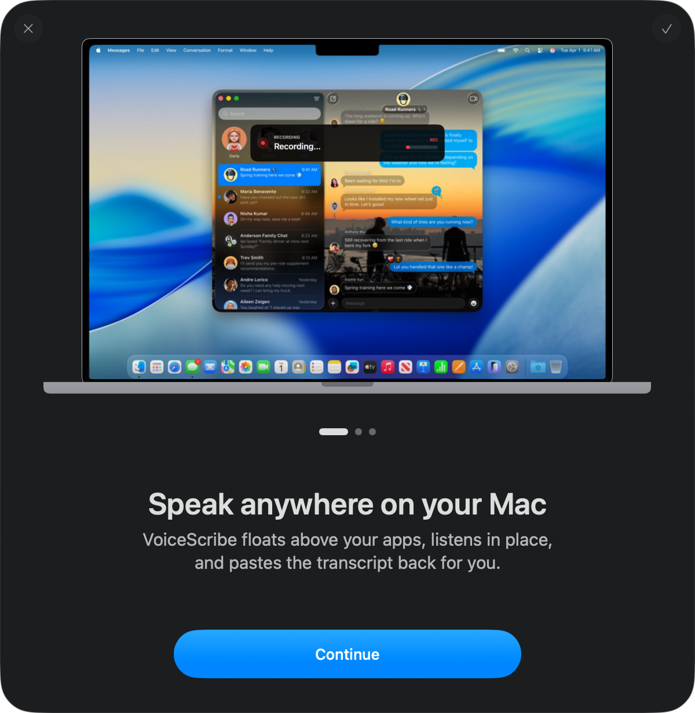
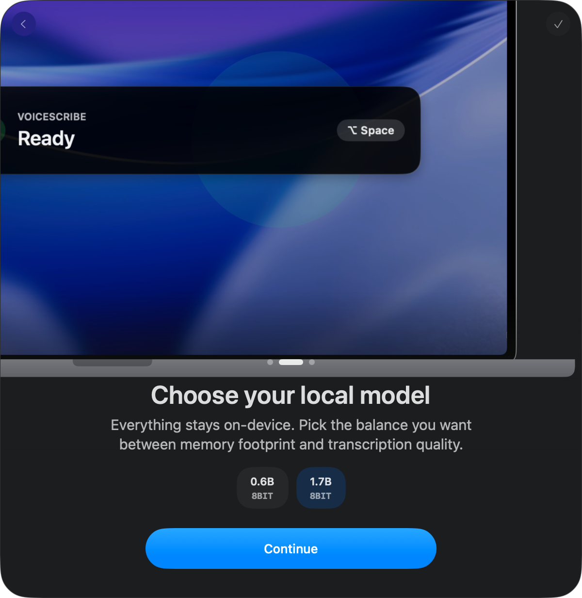
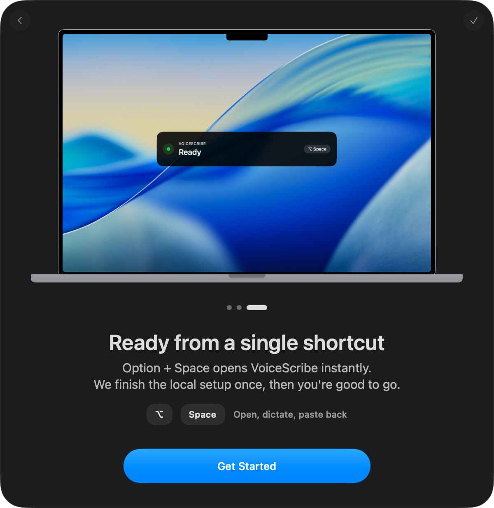

# VoiceScribe

Native local AI dictation for macOS, powered by Qwen3-ASR and MLX.

Press `Option + Space`, speak, press it again, and VoiceScribe pastes clean text back into the app you are using.

VoiceScribe is built for people who want a real offline speech-to-text app for Mac, not a desktop shell hiding a Python daemon in the background.

<p align="center">
  
</p>

## Onboarding

VoiceScribe now opens with a more polished first-run flow designed to feel closer to a native macOS product:

- a cinematic onboarding window that previews the HUD in context
- local model selection directly in the flow
- a simple shortcut handoff before the first real dictation
- local preparation explained before the app starts working in the background

<p align="center">
  
  
  
</p>
<p align="center">
  <em>Speak anywhere • Choose your local model • Ready from a single shortcut</em>
</p>

The first launch can take longer because the selected Qwen3-ASR model is downloaded once and cached locally on your Mac.

## Dictation Flow

Once onboarding is complete, the app stays intentionally simple:

1. Press `Option + Space`
2. Speak normally
3. Press `Option + Space` again
4. VoiceScribe transcribes locally and pastes the result back into your current app

| Ready | Recording |
|---|---|
|  |  |

## Highlights

- Fully local speech-to-text for macOS on Apple Silicon
- Native Swift 6 + MLX runtime with Qwen3-ASR
- No cloud dependency, no Python daemon, no subprocess bridge
- One hotkey, one floating HUD, one fast dictation loop
- Automatic clipboard copy and paste injection
- Strong English and French dictation

## Why Native MLX

VoiceScribe uses a pure Swift + MLX pipeline for offline dictation on macOS.

That gives you:

- fewer moving parts
- better crash isolation
- simpler packaging
- direct Apple Silicon acceleration through Metal
- one native concurrency model across UI, audio, and inference

## Why Qwen3-ASR

Qwen3-ASR is the core reason VoiceScribe feels competitive as a local dictation app on Apple Silicon.

- fast enough for real short-form dictation workflows
- strong quality-to-latency balance in local use
- better multilingual behavior for English and French
- fewer weird artifacts than many offline speech-to-text stacks
- a good fit for MLX + Metal on Mac

## Supported Models

VoiceScribe supports `mlx-community/Qwen3-ASR` variants only.

Default model:

- `mlx-community/Qwen3-ASR-1.7B-8bit`

## Install

Requirements:

- macOS 14+
- Apple Silicon
- microphone permission
- accessibility permission for automatic paste

Latest release:

- [Download VoiceScribe](https://github.com/Flovflo/VoiceScribe/releases/latest)

Build from source:

```bash
git clone https://github.com/Flovflo/VoiceScribe.git
cd VoiceScribe
swift build -c release --arch arm64
./package_app.sh
open VoiceScribe.app
```

## Validation

Fast suite:

```bash
swift test
```

Optional MLX validation:

```bash
VOICESCRIBE_RUN_MLX_TESTS=1 swift test --filter AudioFeatureTests
```

Optional real ASR validation:

```bash
VOICESCRIBE_RUN_ASR_TESTS=1 swift test --filter NativeEngineTests
```

## Docs

- [Native MLX notes](docs/NATIVE_MLX_RELEASE.md)
- [`AGENTS.md`](AGENTS.md)

## License

MIT
