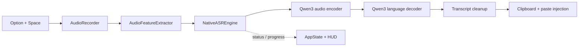

# VoiceScribe

VoiceScribe is a local dictation app for macOS built around a native Swift 6 + MLX speech-to-text pipeline.

Press `Option + Space`, speak, press it again, and VoiceScribe transcribes locally on Apple Silicon, copies the text, and pastes it back at the cursor.

It is meant to feel like a real Mac utility, not a wrapped demo: one hotkey, one floating HUD, one local model runtime, no Python sidecar.

## Screenshots

Real captures from the current macOS app:

| Ready | Recording |
|---|---|
|  |  |

## Why VoiceScribe

- Fully local speech-to-text on macOS
- Native Swift app, no Python daemon, no subprocess bridge
- Qwen3-ASR models running on MLX / Metal
- Floating HUD with one-hotkey dictation flow
- Automatic clipboard copy and text injection
- Multilingual dictation with strong English and French behavior

## Why Native Swift + MLX Matters

The point of this project is not just "offline ASR". It is removing the usual packaging and reliability problems that come with hybrid desktop ML apps.

With a native Swift + MLX stack:

- the app ships as one normal macOS app instead of an app plus a hidden Python runtime
- model loading, progress, errors, and cancellation stay inside one concurrency model
- audio capture, feature extraction, inference, UI, and paste flow are easier to debug end to end
- Metal acceleration is used directly through MLX on Apple Silicon
- release packaging is simpler because there is no external ASR service to spawn, supervise, or crash separately

In practice this means fewer moving parts, less installation friction, and a much cleaner crash surface.

## How It Works

At a high level, VoiceScribe does four things:

1. capture microphone audio on macOS
2. convert it into log-mel features
3. run Qwen3-ASR locally with MLX
4. inject the cleaned transcript back into the active app



## Runtime Architecture

Core pieces:

- `AudioRecorder`
  Captures microphone input, tracks level, resamples to 16 kHz mono, and retries with the system default microphone if the preferred input fails.
- `AudioFeatureExtractor`
  Converts raw audio into Qwen3-compatible log-mel features. CPU and MLX GPU backends are both available.
- `NativeASREngine`
  Actor-based ASR runtime. Downloads model snapshots, validates configs and weights, loads tokenizer assets, and runs transcription chunk by chunk.
- `NativeASRService`
  MainActor wrapper that exposes status, progress, and readiness to SwiftUI.
- `AppState`
  Coordinates the end-to-end dictation flow: recording, model loading, transcription, clipboard copy, and auto-paste.

Key design choices:

- strict model allow-list for `mlx-community/Qwen3-ASR` variants only
- no Python, no shell-based inference, no external ASR daemon
- actor / MainActor separation for model runtime vs UI state
- explicit model cache under `~/Library/Caches/VoiceScribe/models/`
- release bundle includes MLX metallib so the app can run as a normal `.app`

## Supported Models

VoiceScribe currently supports only Qwen3-ASR MLX models:

- `mlx-community/Qwen3-ASR-0.6B-{4bit,5bit,6bit,8bit,bf16}`
- `mlx-community/Qwen3-ASR-1.7B-{4bit,5bit,6bit,8bit,bf16}`

Default:

- `mlx-community/Qwen3-ASR-1.7B-8bit`

Why this default:

- best balance of quality and simplicity
- strong multilingual dictation behavior
- stable validation path in this repository

## Installation

### Requirements

- macOS 14 or newer
- Apple Silicon
- microphone permission
- accessibility permission if you want automatic paste into other apps

### Download

- Latest release: [GitHub Releases](https://github.com/Flovflo/VoiceScribe/releases/latest)

### Build From Source

```bash
git clone https://github.com/Flovflo/VoiceScribe.git
cd VoiceScribe

swift build -c release --arch arm64
./package_app.sh
open VoiceScribe.app
```

The packaging script bundles:

- the release binary
- the app icon
- `Info.plist`
- the MLX `default.metallib` runtime asset

## Usage

1. Launch VoiceScribe.
2. Wait for the model to finish loading on first run.
3. Press `Option + Space` to start recording.
4. Speak normally.
5. Press `Option + Space` again to stop.
6. The transcript is copied and pasted into the currently focused app.

The first run may take longer because the selected Qwen3-ASR model is downloaded and cached locally.

## Validation And Test Coverage

This repository includes three useful validation layers.

### 1. Fast default suite

```bash
swift test
```

Covers:

- audio feature extraction
- app state behavior
- hotkey debounce logic
- model allow-list and error handling
- transcription cleanup helpers

### 2. MLX feature tests

```bash
VOICESCRIBE_RUN_MLX_TESTS=1 swift test --filter AudioFeatureTests
```

Covers:

- MLX feature extraction shape
- parity between CPU and MLX feature pipelines

### 3. Real ASR integration tests

```bash
VOICESCRIBE_RUN_ASR_TESTS=1 swift test --filter NativeEngineTests
```

Covers:

- real model loading
- real inference execution
- sample-audio transcription checks

Sample English and French validations can be run with generated audio:

```bash
say -v Thomas "bonjour ceci est un test de transcription rapide" -o /tmp/voicescribe_fr.aiff
afconvert -f WAVE -d LEI16@16000 /tmp/voicescribe_fr.aiff /tmp/voicescribe_fr.wav
VOICESCRIBE_RUN_ASR_TESTS=1 \
VOICESCRIBE_TEST_AUDIO=/tmp/voicescribe_fr.wav \
VOICESCRIBE_EXPECT_KEYWORDS='bonjour,test' \
swift test --filter NativeEngineTests/testTranscriptionWithSampleAudio

say -v Samantha "hello this is a fast speech transcription quality check" -o /tmp/voicescribe_en.aiff
afconvert -f WAVE -d LEI16@16000 /tmp/voicescribe_en.aiff /tmp/voicescribe_en.wav
VOICESCRIBE_RUN_ASR_TESTS=1 \
VOICESCRIBE_TEST_AUDIO=/tmp/voicescribe_en.wav \
VOICESCRIBE_EXPECT_KEYWORDS='hello,transcription' \
swift test --filter NativeEngineTests/testTranscriptionWithSampleAudio
```

## Performance Notes

VoiceScribe is designed to feel fast in interactive dictation, but the repository is honest about what is validated versus what is still being optimized.

Current state of the included benchmark harness:

- the strict 10-second synthetic benchmark exists in `NativeEngineTests`
- on the validation machine used in this refactor, the release benchmark was still above the current `1000 ms` gate
- stability and correctness are in a good place
- performance optimization remains an open follow-up area

That means:

- VoiceScribe is already usable and validated end to end
- the performance target is a goal, not something this README claims as universally achieved today

## Troubleshooting

### "No audio"

VoiceScribe now retries with the system default microphone if the preferred microphone fails to start. If recording still fails:

- open Settings and reselect the input device
- confirm macOS microphone permission is granted
- disconnect and reconnect problematic USB or Bluetooth microphones

### The shortcut does nothing

- confirm the app is still running in the menu bar
- relaunch the app once after first install
- check that another utility is not already consuming `Option + Space`

### The app loads but transcription is empty

- verify the selected model is a Qwen3-ASR variant
- let the initial model download finish completely
- rerun the English or French sample tests from the validation section

## Development Notes

Helpful docs:

- [Native MLX notes](docs/NATIVE_MLX_RELEASE.md)
- [`AGENTS.md`](AGENTS.md)

Core stack:

- Swift 6
- SwiftUI + AppKit
- MLX
- MLXNN
- Hugging Face `swift-transformers`

## License

MIT
