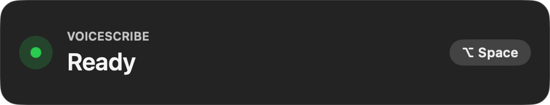
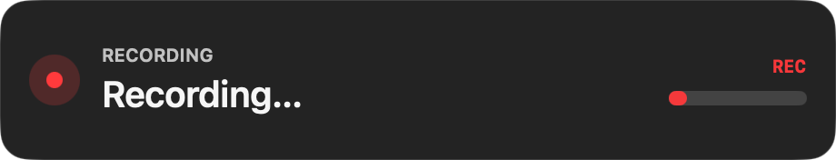

# VoiceScribe

Local AI dictation for macOS.

Press `Option + Space`, speak, press it again, and VoiceScribe pastes clean text back into the app you are using.

VoiceScribe is built for people who want a real offline speech-to-text app for Mac, not a desktop app glued to a hidden Python service.

## Why It Stands Out

- Fully local speech-to-text for macOS on Apple Silicon
- Native Swift + MLX runtime with Qwen3-ASR
- No cloud dependency, no Python daemon, no subprocess bridge
- One hotkey, one floating HUD, one fast dictation flow
- Automatic clipboard copy and paste injection
- Strong English and French dictation

## Screenshots

Real captures from the current app:

| Ready | Recording |
|---|---|
|  |  |

## How It Works

1. Press `Option + Space`
2. Speak normally
3. Press `Option + Space` again
4. VoiceScribe transcribes locally and pastes the result

The first launch can take longer because the selected Qwen3-ASR model is downloaded once and cached on your Mac.

## Why Native MLX Matters

VoiceScribe uses a pure Swift 6 + MLX pipeline for offline dictation on macOS.

That gives you:

- fewer moving parts
- better crash isolation
- simpler packaging
- direct Apple Silicon acceleration through Metal
- one native concurrency model across UI, audio, and inference

## Supported Models

VoiceScribe supports `mlx-community/Qwen3-ASR` variants only.

Default model:

- `mlx-community/Qwen3-ASR-1.7B-8bit`

## Install

Requirements:

- macOS 14+
- Apple Silicon
- microphone permission
- accessibility permission for automatic paste

Latest release:

- [Download VoiceScribe](https://github.com/Flovflo/VoiceScribe/releases/latest)

Build from source:

```bash
git clone https://github.com/Flovflo/VoiceScribe.git
cd VoiceScribe
swift build -c release --arch arm64
./package_app.sh
open VoiceScribe.app
```

## Validation

Fast suite:

```bash
swift test
```

Optional MLX validation:

```bash
VOICESCRIBE_RUN_MLX_TESTS=1 swift test --filter AudioFeatureTests
```

Optional real ASR validation:

```bash
VOICESCRIBE_RUN_ASR_TESTS=1 swift test --filter NativeEngineTests
```

## Performance

VoiceScribe is already validated end to end for local dictation, but the strict synthetic benchmark target is still being improved. The project is intentionally honest about that.

## Docs

- [Native MLX notes](docs/NATIVE_MLX_RELEASE.md)
- [`AGENTS.md`](AGENTS.md)

## License

MIT
